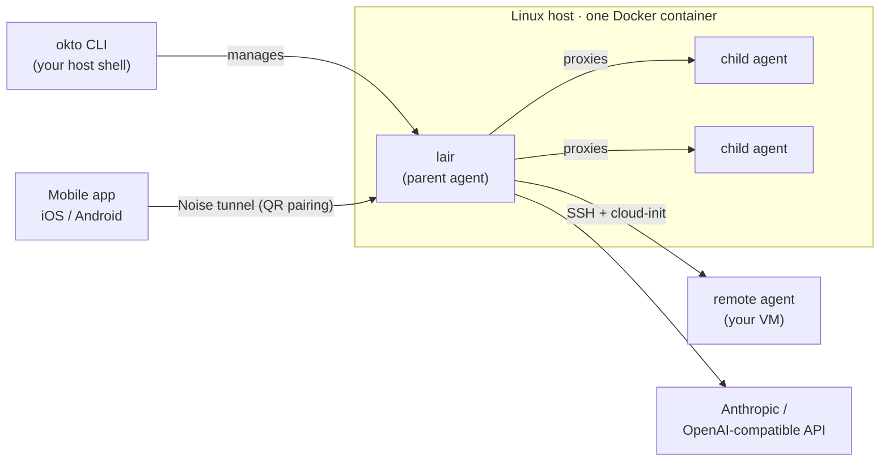

# okto

**okto** lets you run a fleet of local and remote LLM coding agents and drive
them from your phone. A single **`lair`** process runs on a Linux host you
control; the mobile app pairs with it by scanning a QR code and talks to it over
an encrypted [Noise](https://noiseprotocol.org/) tunnel — **no DNS, no TLS
certificates, no inbound web server**. It works with Anthropic and/or any
OpenAI-compatible API.

You manage everything on the host with one command-line tool: **`okto`**.

!!! warning "Experimental"
    okto is experimental and changes frequently between releases. Expect rough
    edges and breaking changes.

## The mental model

- **`lair`** is the parent agent. It runs the agentic loop, holds your API
  credentials, and supervises child agents. It ships as a Docker image
  (`ghcr.io/georgebradford0/lair`) — you never install it directly.
- **`okto`** is the CLI you run on the host to bootstrap and manage lair:
  start/stop, rotate credentials, add MCP servers, view logs and tasks, print
  the pairing QR code, and so on. It talks to lair over a **loopback-only**
  management API (`127.0.0.1:8000`) and edits host files under `~/.okto`.
- The **mobile app** is where you actually chat with agents. Child agents
  appear in the sidebar; their traffic is proxied through lair so they never get
  a public network surface.

## Where to go next

- :material-download: **[Install the CLI](install.md)** — one-line installer, updates, completions.
- :material-rocket-launch: **[Getting started](getting-started.md)** — `okto init`, scan the QR, first chat.
- :material-cog: **[Managing lair](managing-lair.md)** — reload, logs, config, env, image updates.
- :material-robot: **[Agents](agents.md)** — list/start/stop/delete; local, remote, and GPU agents.
- :material-toy-brick: **[MCP servers](mcp.md)** — add, list, remove, import; inheritance.
- :material-bell: **[Push notifications](notifications.md)** — on by default; how to opt out.
- :material-book-open-variant: **[CLI reference](cli-reference.md)** — every command and flag.

## Requirements

- A **Linux host** with a static/public IP and ports **22** (SSH, for remote
  agents) and **8443** (the Noise endpoint) reachable.
- **Docker** (the CLI installs it during `okto init` if it's missing).
- At least one **LLM provider API key** — Anthropic and/or an OpenAI-compatible
  endpoint.
- An **iPhone or Android device** for the mobile client.

The CLI and runtime are **Linux-only** (`x86_64` and `aarch64`). macOS/Windows
are not supported as a runtime host.
